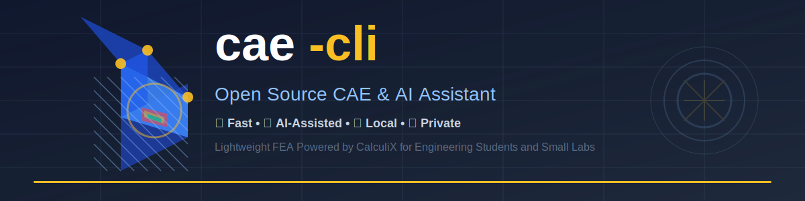

<div align="center">
  <!-- TODO: Add logo image -->
  <!--  -->
  
  <h1>cae-cli</h1>
  <p>A lightweight CAE (Computer-Aided Engineering) command-line tool powered by <a href="https://www.calculix.org/">CalculiX</a> for finite element analysis and an AI-assisted diagnosis system.<br>
  For mechanical engineering students and small labs who can't afford commercial software.</p>
</div>

<p align="center">
  <a href="https://github.com/yd5768365-hue/cae-cli">GitHub</a> · <a href="https://pypi.org/project/cae-cxx/">PyPI</a> · <a href="https://github.com/yd5768365-hue/cae-cli/issues">Bug Reports</a>
</p>

<p align="center">
  <a href="https://www.python.org/"></a>
  <a href="https://pypi.org/project/cae-cxx/"></a>
  <a href="LICENSE"></a>
  <a href="https://www.calculix.org/"></a>
  <br><br>
  <a href="https://github.com/yd5768365-hue/cae-cli/actions/workflows/ci-cd.yml"></a>
  <a href="https://codecov.io/gh/yd5768365-hue/cae-cli"></a>
</p>

---

## Screenshots

<div align="center">

<table>
<tr>
<td align="center">
<h3>AI Diagnosis</h3>
<!-- TODO: Add screenshot -->
<!--  -->
[//]: # ()
<p><em>AI-powered problem detection with actionable fix suggestions</em></p>
</td>
</tr>
<tr>
<td align="center">
<h3>3D Visualization</h3>
<!-- TODO: Add screenshot -->
<!--  -->
[//]: # ()
<p><em>Interactive displacement and stress nephogram in browser</em></p>
</td>
</tr>
</table>

</div>

---

## Features

- **30-Second Startup** — One command to solve, get results immediately
- **AI-Assisted Diagnosis** — Three-level diagnosis system (rules/cases/AI) pinpoints problems with copy-pasteable fixes
- **Local & Private** — All computation runs locally, no data uploaded
- **Complete Workflow** — Mesh generation, solving, visualization, and PDF reporting
- **Protocol-Based Design** — Type-safe keyword classes with IDE autocomplete
- **Format Conversion** — `.frd` → `.vtu`, `.msh` → `.inp`, `.dat` → `.csv`

### Three-Level AI Diagnosis

| Level | Description | LLM Calls |
|-------|-------------|-----------|
| **Level 1** | 528+ CalculiX source hardcoded error patterns | 0 |
| **Level 2** | 638 official test case physical data comparison | 0 |
| **Level 3** | AI deep analysis with syntax constraints | Optional |

---

## Quick Start

```bash
# 1. Install (30 seconds)
pip install cae-cxx && cae install

# 2. Generate cantilever beam template
cae inp template cantilever_beam -o beam.inp

# 3. Solve
cae solve beam.inp

# 4. AI diagnosis (optional)
cae diagnose results/
```

### Diagnosis Example

```
$ cae solve contact.inp
╭───────────────────────╮
║  Solve failed  0.1s   ║
╰───────────────────────╯

$ cae diagnose results/
Rule detection: Found 2 issues
[X] [material] Material missing elastic constants
    -> Add *ELASTIC or *ELASTIC,TYPE=ISOTROPIC in *MATERIAL

[X] [convergence] Increment size smaller than minimum
    -> Reduce initial step size (*STATIC first parameter)
```

---

## Installation

```bash
# Basic installation
pip install cae-cxx

# Install with AI support
pip install cae-cxx[ai]

# Install with mesh and PDF support
pip install cae-cxx[mesh,report]
```

| System | One-liner | Manual |
|--------|-----------|--------|
| Windows | `cae install` | [calculix.org](https://calculix.org) |
| macOS | `cae install` | `brew install calculix` |
| Linux | `cae install` | `sudo apt install calculix-ccx` |

---

## Command Reference

### `cae solve` — Solve

```bash
cae solve model.inp                    # Standard solve
cae solve model.inp -o results/        # Output to directory
cae solve model.inp --timeout 7200    # 2 hour timeout
```

### `cae diagnose` — Three-Level Diagnosis

```bash
cae diagnose results/                           # Rules + cases + AI
cae diagnose results/ -i model.inp            # Specify INP for case matching
cae diagnose results/ -i model.inp --no-ai   # Skip AI analysis
```

### `cae mesh` — Mesh Generation

```bash
cae mesh gen geo.step -o mesh.inp              # Generate mesh
cae mesh gen geo.step -o mesh.inp -s 2.0      # Mesh size
cae mesh check mesh.inp                        # Preview mesh
```

### `cae inp` — INP File Processing

```bash
cae inp info model.inp                       # Structure summary
cae inp check model.inp                      # Validation
cae inp show model.inp -k *MATERIAL         # Show block
cae inp modify model.inp -k *ELASTIC --set "210000, 0.3"  # Modify
cae inp template cantilever_beam -o beam.inp # Generate from template
```

### `cae view` — 3D Visualization

```bash
cae view results/            # Open in browser (ParaView Glance)
```

### `cae report` — PDF Report

```bash
cae report results/                         # Generate report
cae report results/ -o report.pdf           # Specify output path
```

> Requires weasyprint: `pip install cae-cxx[report]`

---

## Comparison with Commercial CAE Software

| | ANSYS/Abaqus | cae-cli |
|---|--------------|---------|
| **Cost** | $10,000+/year | Free (open source) |
| **Startup Time** | Minutes to hours | 30 seconds |
| **Learning Curve** | Steep | Simple CLI |
| **AI Diagnosis** | Generic suggestions | **Source-code hardcoded rules** |
| **Target User** | Enterprise | Students, small labs |
| **Deployment** | License server | Local |

---

## FAQ

<details>
<summary>What's the difference from FreeCAD FEM?</summary>

FreeCAD FEM is a GUI interface, suitable for mouse operations. cae-cli is a **command-line tool** suitable for:
- Batch processing multiple models
- Automation workflow integration
- AI-assisted diagnosis with rule-layer fixes

If you prefer mouse operations, FreeCAD is more intuitive. If you need automation or quick debugging, cae-cli is more efficient.

</details>

<details>
<summary>Do I need a GPU?</summary>

No. Both CalculiX solver and AI models support CPU execution. The AI model is about 5 GB (Q4 quantized) and runs on regular laptops.

</details>

<details>
<summary>Is my data secure?</summary>

Yes. All computation and AI analysis run locally. No data is uploaded to any server. Suitable for projects involving confidential or sensitive data.

</details>

<details>
<summary>What element types are supported?</summary>

- **Solid elements**: C3D4/6/8/15/20 (including second-order)
- **Shell elements**: S3/4/6/8 (including reduced integration)
- **Beam elements**: B31/B32
- **Spring elements**: Spring1~Spring7
- **Contact**: Contact1~19, Mortar
- **Thermal**: steady-state/transient/thermal-structural coupling
- **Dynamics**: modal/frequency response/transient response

</details>

---

## Project Structure

```
cae-cli/
├── cae/
│   ├── main.py              # CLI entry (Typer)
│   ├── inp/                 # INP file processing, keywords, templates
│   ├── solvers/             # Solver abstraction + CalculiX implementation
│   ├── mesh/                # Gmsh integration, meshio conversion
│   ├── material/            # Elastic, Plastic, HyperElastic models
│   ├── contact/             # ContactPair, SurfaceInteraction, Friction, Tie, Gap
│   ├── coupling/            # Coupling constraints, MPC
│   ├── viewer/              # FRD/DAT parsing, VTK export, HTML/PDF reports
│   ├── ai/                  # LLM client, 3-level diagnosis system
│   └── installer/           # Solver and AI model installation
└── tests/                  # 100+ test cases
```

---

## Tech Stack

| Component | Technology | Description |
|-----------|------------|-------------|
| CLI | Typer + Rich | Command line with enhanced output |
| Mesh | Gmsh 4.x | Automatic mesh generation |
| Solver | CalculiX 2.22+ | Open source FEA |
| Format | meshio 5.x | Multi-format conversion |
| Visualization | ParaView Glance | Web 3D viewer |
| AI | llama-cpp-python | Local LLM inference |

---

## Development

```bash
# Clone
git clone https://github.com/yd5768365-hue/cae-cli
cd cae-cli

# Install development version
pip install -e ".[dev,ai,mesh,report]"

# Run tests
pytest tests/ -v

# Lint
ruff check cae/
```

---

## License

MIT License - see [LICENSE](LICENSE) file for details.

---

<div align="center">
  <strong>For mechanical engineering students and small labs who can't afford commercial software.</strong>
</div>
